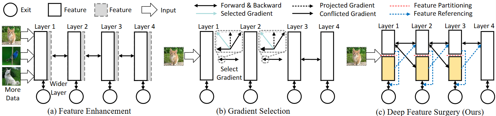
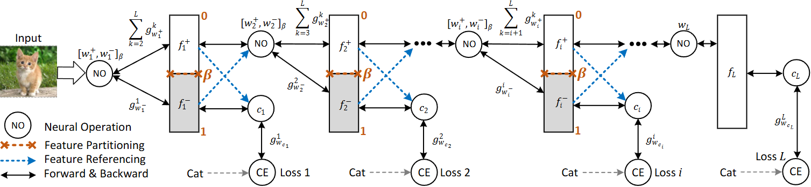
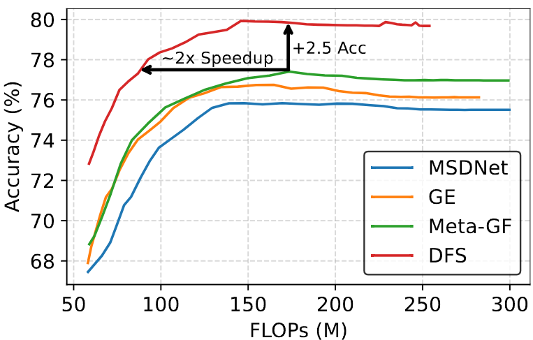
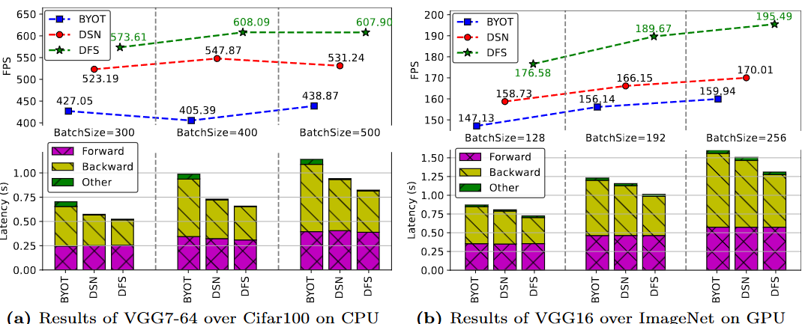

# Deep Feature Surgery: Towards Accurate and Efficient Multi-Exit Networks

This repo is the official implementation of "Deep Feature Surgery: Towards Accurate and Efficient Multi-Exit Networks" (ECCV 2024).
> Autthors: [Cheng Gong](https://scholar.google.com/citations?user=SOUobmQAAAAJ), Yao Chen, Qiuyang Luo, Ye Lu, Tao Li, Yuzhi Zhang, Yufei Sun, Le Zhang

[[Paper](https://arxiv.org/abs/2407.13986)][[Code](https://github.com/GongCheng1919/dfs)]

## Description

Deep Feature Surgery (DFS) resolves gradient conflict issues during the training of multi-exit networks by using two techniques including feature partitioning and feature referencing.
The feature partitioning separates shared features along the depth axis among all exits to alleviate gradient conflict while simultaneously promoting joint optimization for each exit.
Subsequently, feature referencing enhances
multi-scale features for distinct exits across varying depths to improve the model accuracy.
Furthermore, DFS reduces the training operations with the reduced complexity of backpropagation.
Experimental results on Cifar100 and ImageNet datasets exhibit that DFS provides up to a **50.00%** reduction in training time and attains up to a **6.94%** enhancement in accuracy when contrasted with baseline methods across diverse models and tasks.
Budgeted batch classification evaluation on MSDNet demonstrates that DFS uses about $\mathbf{2}\boldsymbol{\times}$ fewer average FLOPs per image to achieve the same classification accuracy as baseline methods on Cifar100.

The figure below shows the differences between previous studies and ours.
(a) Feature enhancement introduces additional features to improve the accuracy of exits. 
(b) Gradient selection adjusts gradients from conflicting sources to attain consistent update directions.
(c) Our method alleviates gradient conflict and ensures end-to-end joint optimization of exits.


The figure below shows the training framework of DFS. 
The black arrow represents forward and backward propagation. The blue arrow indicates feature reference. The red-doted line represents the partitioning position. DFS splits the features of each layer into two distinct parts $f_i^+$ and $f_i^-$ with coefficient $\beta$, which reduces the number of shared weights $w_i^+$ among different exits thus mitigating gradient conflict and reducing backward computation operations.
DFS cross-references the shared features and exit-specific features among exits with varying depths in the forward phase while ignoring this in the backward phase, thus using more features for predicting tasks while not introducing more inconsistent gradients.


## Usage
You can clone this project, then enter the ```dfs/scripts``` folder as follows.
```shell
git clone https://github.com/GongCheng1919/dfs.git
cd dfs/scripts
```

You can find all the experimental scripts in this folder and run them to obtain results.
Taking the vgg on Cifar100 as an example, you can run the following command to train the vgg model with DFS.
```shell
bash training_vgg_on_cifar100.sh -m vgg7_64_cifar100 -b 200 -d 0.5 -n 1 -r 1 -i 1 -k 0 -f 0 -g \'\' -t cifar100 -o "~/.cache/datasets/cifar100"
```

We have provided the ```vgg```, ```resnet```, ```msdnet```, ```vit```, and ```bert``` models in the ```dfs/src/models``` folder.
Besides, you can find all the source code in the ```dfs/src``` folder. You can modify the source code to train your model with DFS.

## Docker Environment
If you have a PyTorch environment, you can install the packages listed in ```requirements.txt``` to install all the dependencies for training and testing the models with DFS.
If you do not have a PyTorch environment, you can use the docker environment provided in this repo to train and test the models with DFS.
Please use the following command to build the docker environment.
```shell
cd dfs
docker-compose up --build -d
```

## Examples
We provide the ```FeatureReroute``` and ```dns_embbeding``` modules for fast architecture modification in ```dfs/src/models/feature_reroute.py```.
These modules can help you to quickly modify your architectures with DFS and obtain the training results.
We provide a simple example below.
```python
from .feature_reroute import dns_embbeding
class DNSWapparedViT(nn.Module):
    def __init__(self,
                 backbone_vit_model,
                 dns_ratio=0.5,
                 use_dns=True,
                 use_fr=True,
                ):
        super().__init__()
        self.dns_ratio = dns_ratio
        self.use_dns = use_dns
        self.use_fr = use_fr
        # A vit model, such as ViT-B
        self.backbone_model = backbone_vit_model
        self.nBlocks = len(self.backbone_model.blocks) - 6
        self.blocks = self.backbone_model.blocks
        # Create dns_embbeding Objects for each block
        self.dns_x_subs_objs = [dns_embbeding(-1,self.dns_ratio,self.use_dns,self.use_fr) for _ in range(self.nBlocks-1)]
        self.dns_x_subs_objs.append( 
            dns_embbeding(-1,1,False,False)
        )
        # Register hooks to catch the middle outputs of ViTs with DFS
        self.backbone_model.dns_x_subs_hooks = []
        for i in range(self.nBlocks): 
            handle = self.blocks[6+i].register_forward_hook(self.dns_x_subs_objs[i].dns_embbeding_hook()) 
            self.backbone_model.dns_x_subs_hooks.append(handle)
```
The detailed example can be found [here](./src/models/dns_vit.py).

## Experimental results
**Results of ResNet18 on Cifar100:** 
Compared with [DSN](http://proceedings.mlr.press/v38/lee15a.pdf) and [BYOT](https://openaccess.thecvf.com/content_ICCV_2019/papers/Zhang_Be_Your_Own_Teacher_Improve_the_Performance_of_Convolutional_Neural_ICCV_2019_paper.pdf), DFS achieves higher accuracy across all exits by mitigating gradient conflict and reusing the multi-scale features of different exits.
For early exits, such as exit 1 and exit 2, the accuracy improvements are up to **6.94%** and **3.63%**, respectively.
The ensemble accuracy results of DFS also outperform the same counterparts from DSN and BYOT by **1.62%** and **1.22%**, respectively. 

| Methods | Exit1 | Exit2 | Exit3 | Exit4 | Ensemble |
| --- | --- | --- | --- | --- | --- |
| Params (M) | 0.43 | 0.96 | 3.11 | 11.17 | - |
| FLOPs (M) | 169.62 | 300.22 | 431.05 | 559.75 | - |
| [DSN](http://proceedings.mlr.press/v38/lee15a.pdf) (AISTATS2015)  | 67.23 | 73.80 | 77.75 | 78.38 | 79.27 |
| [BYOT](https://openaccess.thecvf.com/content_ICCV_2019/papers/Zhang_Be_Your_Own_Teacher_Improve_the_Performance_of_Convolutional_Neural_ICCV_2019_paper.pdf) (ICCV2019) |  67.85 | 74.57 | 78.23 | 78.64 | 79.67 |
| DFS | **74.17** | **77.43** | **78.82** | **79.93** | **80.89** |

**Results of MSDNet on Cifar100:** 
The results demonstrate that DFS consistently outperforms all baselines across all exits of MSDNet, and significantly improves the overall performance.
Compared with the baselines, the average accuracy improvements of DFS on the 7 exits are **6.64%**, **5.72%**,**4.86%**, **4.47%**, **4.42%**, **3.99%**, and **3.76%**, respectively.
The average accuracy improvement of DFS across all tasks and all baselines is **4.84%**. 

| Methods | Exit1 | Exit2 | Exit3 | Exit4 | Exit5 | Exit6 | Exit7 |
| --- | --- | --- | --- | --- | --- | --- | --- |
| Params (M) | 0.90 | 1.84 | 2.80 | 3.76 | 4.92 | 6.10 | 7.36 |
| FLOPs (M) | 56.43 | 101.00 | 155.31 | 198.10 | 249.53 | 298.05 | 340.64 |
| [MSDNet](https://par.nsf.gov/biblio/10064650) (ICLR2018) | 64.10 | 67.46 | 70.34 | 72.38 | 73.06 | 73.81 | 73.89 |
| [GE](https://openaccess.thecvf.com/content_ICCV_2019/papers/Li_Improved_Techniques_for_Training_Adaptive_Deep_Networks_ICCV_2019_paper.pdf) (ICCV2019) | 64.00 | 68.41 | 71.86 | 73.50 | 74.46 | 75.39 | 75.96 |
| [CAGrad](https://proceedings.neurips.cc/paper_files/paper/2021/file/9d27fdf2477ffbff837d73ef7ae23db9-Paper.pdf) (NIPS2021) | 68.78 | 72.55 | 74.23 | 74.97 | 75.35 | 75.82 | 76.08 |
| [PCGrad](https://proceedings.neurips.cc/paper_files/paper/2020/file/3fe78a8acf5fda99de95303940a2420c-Paper.pdf) (NIPS2020) | 67.06 | 71.37 | 74.86 | 75.78 | 76.25 | 76.95 | 76.71 |
| [Meta-GF](https://www.ecva.net/papers/eccv_2022/papers_ECCV/papers/136710691.pdf) (ECCV2022) | 67.97 | 72.27 | 75.06 | 75.77 | 76.38 | 77.11 | 77.47 |
| [BDL](https://ieeexplore.ieee.org/abstract/document/10155768)-1 (TNNLS2023) | 66.29 | 69.31 | 71.15 | 72.05 | 72.61 | 73.23 | 73.59 |
| [BDL](https://ieeexplore.ieee.org/abstract/document/10155768)-2 (TNNLS2023)| 65.81 | 68.93 | 71.01 | 72.45 | 72.98 | 73.42 | 74.27 |
| [WPN](https://www.ecva.net/papers/eccv_2022/papers_ECCV/papers/136710363.pdf) (ECCV2022) | 62.26 | 67.18 | 70.53 | 73.10 | 74.80 | 76.05 | 76.31 |
| [Nash-MTL](https://proceedings.mlr.press/v162/navon22a/navon22a.pdf) (ICML2022) | 64.14 | 69.23 | 72.64 | 74.89 | 75.32 | 75.88 | 76.75 |
| [DR-MGF](https://arxiv.org/pdf/2305.19844) (arXiv2023) | 67.82 | 72.45 | 74.77 | 75.77 | 76.56 | 76.90 | 77.01 |
| DFS | **72.46** | **75.64** | **77.50** | **78.54** | **79.2** | **79.45** | **79.56** |

**Results of MSDNet on ImageNet:**
Results show that DFS outperforms all the baselines at the early exits even without extra training tricks, and the average accuracy improvements of DFS on the 5 tasks are
**4.33%**, **2.98%**, **2.04%**, **1.31%**, **1.10%**.
The average accuracy achieved by DFS is **69.05%**, which significantly exceeds baselines, and the average accuracy improvement achieves **2.35%**. 
| Methods | Exit1 | Exit2 | Exit3 | Exit4 | Exit5 | Average |
| --- | --- | --- | --- | --- | --- | --- |
| Params (M) | 4.24 | 8.77 | 13.07 | 16.75 | 23.96 | - |
| FLOPs (G) | 0.34 | 0.69 | 1.01 | 1.25 | 1.36 | - |
| [MSDNet](https://par.nsf.gov/biblio/10064650) (ICLR2018) | 56.64 | 65.14 | 68.42 | 69.77 | 71.34 | 66.26 |
| [GE](https://openaccess.thecvf.com/content_ICCV_2019/papers/Li_Improved_Techniques_for_Training_Adaptive_Deep_Networks_ICCV_2019_paper.pdf) (ICCV2019)| 57.28 | 66.22 | 70.24 | 71.71 | 72.43 | 67.58 |
| [CAGrad](https://proceedings.neurips.cc/paper_files/paper/2021/file/9d27fdf2477ffbff837d73ef7ae23db9-Paper.pdf) (NIPS2021) | 58.37 | 64.21 | 66.88 | 68.22 | 69.42 | 65.42 |
| [PCGrad](https://proceedings.neurips.cc/paper_files/paper/2020/file/3fe78a8acf5fda99de95303940a2420c-Paper.pdf) (NIPS2020) | 57.62 | 64.87 | 68.93 | 71.05 | 72.45 | 66.98 |
| [Meta-GF](https://www.ecva.net/papers/eccv_2022/papers_ECCV/papers/136710691.pdf) (ECCV2022) | 57.43 | 64.82 | 69.08 | 71.67 | **73.27** | 67.25 |
| **DFS** | **61.80** | **68.03** | **70.75** | **71.79** | 72.88 | **69.05** |

**Budgeted Batch Classification:**
The results show that DFS consistently outperforms all baselines across all budgets.
With an average budget of 170MFLOPs, DFS achieves an accuracy of ${\sim}$**79.5%**, which is ${\boldsymbol{\sim}}$**2.5%** higher than that of Meta-GF with the same budget.
DFS uses ${\boldsymbol{\sim}}$**2**${\boldsymbol{\times}}$ fewer FLOPs to achieve the same classification accuracy compared to Meta-GF, which is the best among all baselines. 
You can find the data in ```dfs/data-src```folder.
<!--  -->
<!--  -->
<div align="center">
    
</div>

**Training Efficiency Validation:**
We train VGG7-64 on CPU (2×20-core Intel Xeon Gold 6248) and VGG16 on GPU (1× NVIDIA RTX A6000) to evaluate model training efficiency,
both are trained with 100 batches of data inputs.
For different batch sizes and devices, all the DSN, BYOT, and DFS have similar forward latency, since their forward operations are the same.
For the backward latency, DFS has shorter latency compared with DSN and BYOT across all batch sizes and devices mainly because 
DFS reduces the required number of operations for backward computation.
BYOT uses knowledge distillation and intermediate feature distillation to improve model accuracy, resulting in much higher backward latency and other latency than DSN and DFS.
The actual average FPS improvements obtained through experiments are **11.69%** and **13.51%**, both of them are consistent with the theoretical FPS improvements of VGG7-64 and VGG16, which are **14.29%** with $L=6$ (convolutional layers of VGG7-64) and **15.58%** with $L=13$ (convolutional layers of VGG16). 
<div align="center">
    
</div>

## Citation

If you find this project useful, please cite our [paper](https://arxiv.org/abs/2407.13986).
```
@inproceedings{gong2024deep,
  title={Deep Feature Surgery: Towards Accurate and Efficient Multi-Exit Networks},
  author={Gong, Cheng and Chen, Yao and Luo, Qiuyang and Lu, Ye and Li, Tao and Zhang, Yuzhi and Sun, Yufei and Zhang, Le},
  booktitle={ECCV},
  year={2024}
}
```
